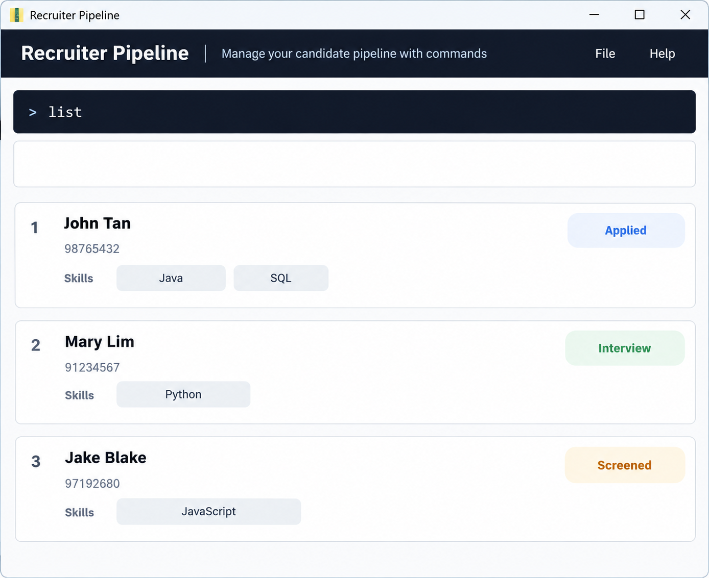

# Scoutly

Scoutly is a desktop candidate pipeline and recruitment management application for recruiters who prefer typing commands. It combines a command line with a graphical interface to help recruiters manage candidate details and track progress through the hiring process.

*UI mockup of the intended product. Features and layout are under development.*

## Current features

- Add, list, and delete candidates.
- View a candidate’s profile.
- Update a candidate’s hiring stage: Applied, Screened, Interview, Offered, or Rejected.
- Receive clear feedback for successful commands and invalid input.

Use `stage INDEX s/STAGE`, for example `stage 1 s/Interview`, to update a candidate's hiring stage. New candidates default to Applied; stages appear on candidate cards and in `view` output and are saved across restarts. The dashboard shown above remains a planned layout.

## Documentation

- [Project website](https://ay2627s1-cs2103t-t09-3.github.io/tp/)
- [User Guide](https://ay2627s1-cs2103t-t09-3.github.io/tp/UserGuide.html)
- [Developer Guide](https://ay2627s1-cs2103t-t09-3.github.io/tp/DeveloperGuide.html)
- [About Us](https://ay2627s1-cs2103t-t09-3.github.io/tp/AboutUs.html)

## Acknowledgements

This project is based on the AddressBook-Level3 project created by the [SE-EDU initiative](https://se-education.org).
