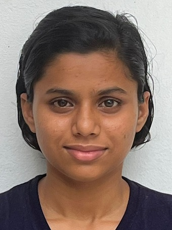
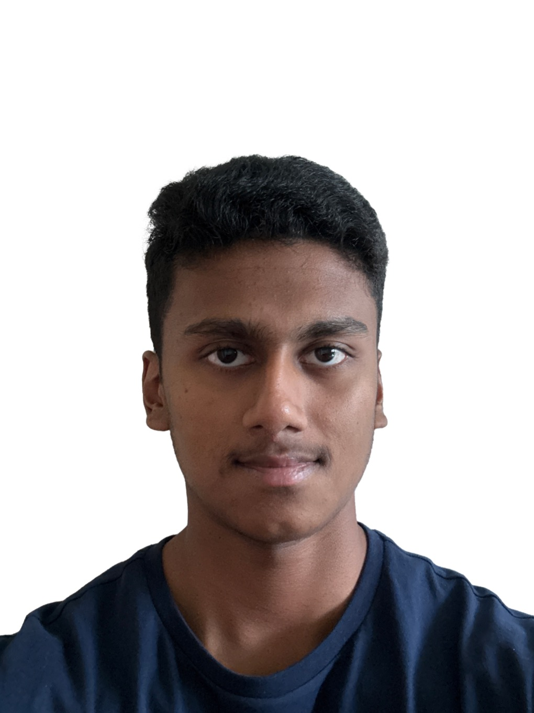
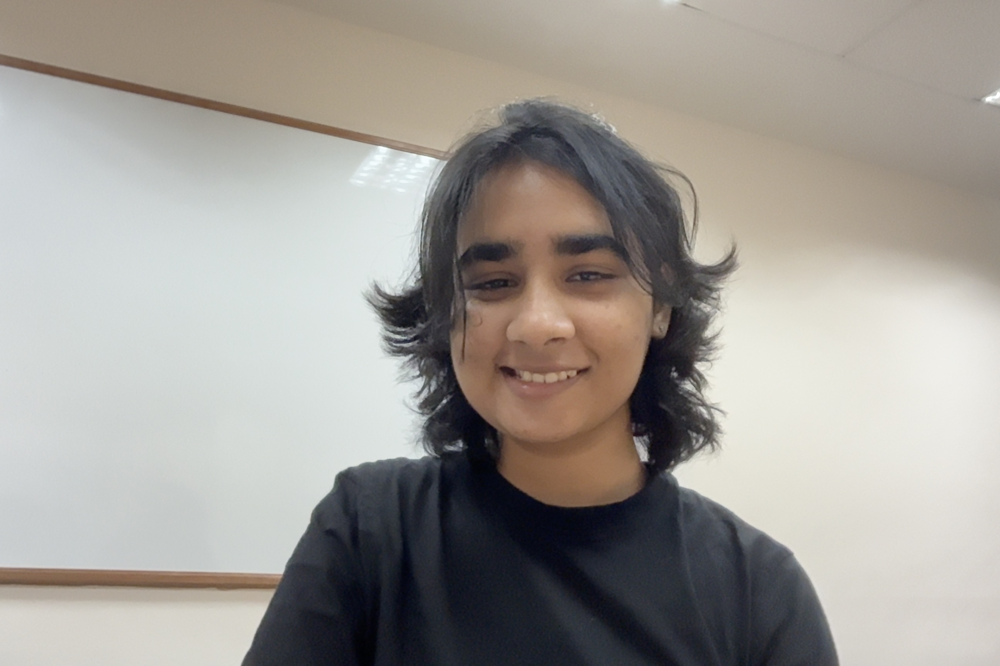
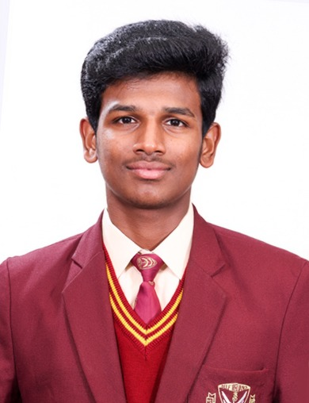
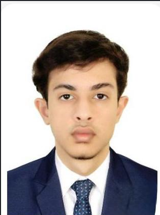

# About Us

We are a team based in the [School of Computing, National University of Singapore](http://www.comp.nus.edu.sg).

We develop Scoutly, a desktop candidate pipeline and recruitment management application.

For project questions and bug reports, use our [issue tracker](https://github.com/AY2627S1-CS2103T-T09-3/tp/issues).

## Project team

### Aayushi

[[github](https://github.com/aayushi122)]

* Role: Developer
* Responsibilities: Manage access

### Sidharth Bairy

[[github](https://github.com/sidharthbairy)]
[[portfolio](team/sidharthbairy.md)]

* Role: Developer
* Responsibilities: Testing and code quality

### Antara Daw

[[github](https://github.com/antaradaw)]

* Role: Developer
* Responsibilities: Integration — combine teammates' changes and resolve merge conflicts

### Gowrinath JK

[[github](https://github.com/GowrinathJK)]
[[portfolio](https://gowrinathjk.github.io/portfolio/)]

* Role: Developer
* Responsibilities: Documentation, UI, testing, and DevOps

### Rahul Ganesh

[[github](https://github.com/rahulg1507)]

* Role: Developer
* Responsibilities: Implement and maintain project features, write and maintain tests, debug issues, and contribute to code reviews and technical development.

